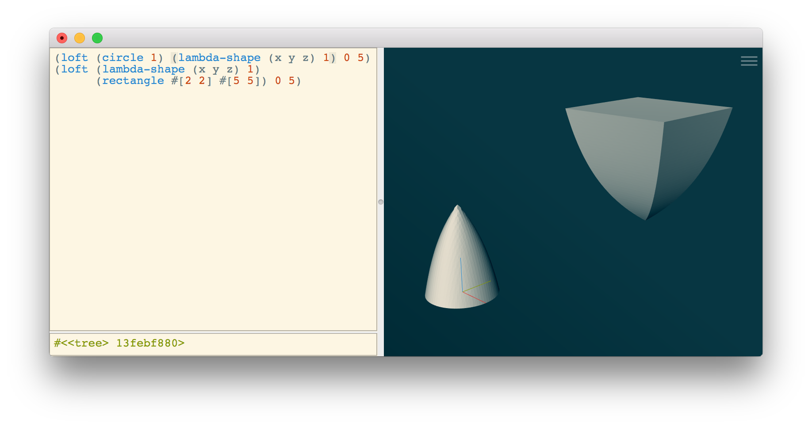

# IN PROGRESS

# The Studio GUI
Such GUI!

Much Scheme!

Wow!

# Constructive solid modeling
## Shapes
3D shapes are functions `f(x, y, z) -> d`, where `d` is some distance value.
If `d < 0`, then the point `[x y z]` is inside the model;
`d == 0` is on the surface, and `d > 0` is outside.

2D shapes are infinite on the Z axis.
They render strangely; use `extrude-z` to clamp them.

### Lofting

Lofting is a weighted sum of two fields at the given XY position,
with the weight varying as a function of Z.

This means it behaves counter-intuitively if the two shapes are
offset in the XY plane.

In the visualization below, between the two shapes,
both distance fields are positive (i.e. outside the shape),
so no amount of blending will make the shape exist there.



`loft-between` is designed to work around these limitations.
It combines a loft operation with an XY skew,
to keep the distance fields well-behaved.


# Working directly with f-reps
## `lambda-shape` and `define-shape`
`lambda-shape` is syntactic sugar to construct and compile a shape function object.
It works like regular `lambda`, but with enough differences to keep users on their toes.

Unlike normal `lambda` functions, it must take exactly three arguments.
These are the coordinates at which the function is being evaluated,
and are typically assigned the names `x y z`.

For example, a circle of radius 1 can be defined as
```scheme
(lambda-shape (x y z)
  (- (sqrt (+ (square x) (square y))) 1))
```

Unlike regular `lambda` functions, `lambda-shape` immediately evaluates the given expression
symbolically to "compile" it to a lower-level representation.
This means that if it represents a recursive construction,
it must terminate when passed abstract symbols for `x y z`.
One more limitation: the low-level representation does not support conditionals (yet).

`(define-shape (f x y z) ...)` is syntactic sugar for `(define f (lambda-shape (x y z) ...))`,
matching the behavior of `define`.

## `remap-shape`
Remember that shapes can be thought of as functions of the form `f(x, y, z) -> d`.
`remap-shape` takes in `f` and formulas to generate modified coordinates of the form
```
x' = mx(x, y, z)
y' = my(x, y, z)
z' = mz(x, y, z)`
```
It returns a new function `f'(x, y, z) = f(mx(x, y, z), my(x, y, z), mz(x, y, z))`

This is fairly abstract, but is immediately useful for coordinate forms.

To stretch a shape on the X axis, we can use `remap-shape` with `x' = x / 2`:
```scheme
(define (stretch-x shape)
    (remap-shape (shape x y z)
      (/ x 2)   ; mx(x, y, z)
      y         ; my(x, y, z)
      z         ; mz(x, y, z)
  ))
```

### Sidebar: Hygenic macros
`remap-shape` is implemented with a macro.

The trailing `x y z` (in `remap-shape (shape x y z)`) are necessary to
keep the macro [hygenic](https://en.wikipedia.org/wiki/Hygienic_macro).

This means that one could define `stretch-x` as follows, replacing `shape` with `x`:

```scheme
(define (stretch-x x)
    (remap-shape (x x y z)
      (/ x 2)   ; mx(x, y, z)
      y         ; my(x, y, z)
      z         ; mz(x, y, z)
  ))
```

It would still work, but is hugely confusing; don't do this.

## `shape-eval`
This doesn't work on expressions that contain free variables.

That is intentional.

# Syntax extensions
## Vectors
Studio includes special syntax for working with 2D and 3D vectors.
Vectors are written as `[x y]` (for 2D vectors) or `[x y z]` (for 3D vectors).

Older code uses `#[...]`, but the leading `#` is now optional.

Arithmetic behaves as expected when called on vectors,
including mixed vector-scaler operations:
```
(+ [0 1] [2 3]) => [2 4]
(+ [0 1] 5) => [5 6]
```

They come with helpful functions
- `(norm v)`: vector length (L2 norm)
- `(dot a b)`: dot product
- `(cross a b)`: cross product (3D only)

## Free variables
Any number prepended with a hash sign (e.g. `#1`) is treated as a
"free variable".  A shape that contains one or more free variables
can be interacted with by clicking-and-dragging on its surface;
a fairly simple solver will attempt to manipulate the free variables
to keep the surface at the cursor.

There are cases where having multiple free variables causes problems.
Consider setting the position and width of a cube:

```scheme
(define (pos #1))
(define (width #2))
(box #[pos 0 0] #[(+ pos width) 1 1])
```
If you click and drag on the far face (on the X axis), it will change
both `pos` and `width`, but we probably only want to change `width`.
To selectively prevent a free variable from changing, use the `constant`
function, e.g.
```scheme
(define pos #1)
(define width #2)
(box #[pos 0 0] #[(+ (constant pos) width) 1 1])
```

## The `sequence` macro
Nested transforms can lead to ugly code, where the transform arguments are far from
the transform name itself:
```
(move
  (scale-x
    (sphere #[0 0 0] 1)
    0.5)
   #[1 0 0])
```

Transforms in the standard library always accept a shape as their first argument,
which lets us use a special macro named `sequence` to make this ergonomic:
```
(sequence (sphere #[0 0 0] 1)
          (scale-x 0.5)
          (move #[1 0 0]))
```

The `remap-shape` macro also works in this context:
```
(sequence (sphere #[0 0 0] 1)
          (remap-shape (x y z) (* x 2) y z)
          (move #[1 0 0]))
```

## Working with `values`

# Working from the Guile command line
If you run `make install` on a Mac or Linux system,
pre-compiled modules will be installed to Guile's `%site-ccache-dir`

You can then load these modules from the Guile REPL:
```
bash-4.4$ guile
GNU Guile 2.2.3
Copyright (C) 1995-2017 Free Software Foundation, Inc.

Guile comes with ABSOLUTELY NO WARRANTY; for details type `,show w'.
This program is free software, and you are welcome to redistribute it
under certain conditions; type `,show c' for details.

Enter `,help' for help.
scheme@(guile-user)> (use-modules (libfive kernel) (libfive stdlib csg) (libfive stdlib shapes))
scheme@(guile-user)> (circle 1)
$1 = #<<shape> 102275140>
scheme@(guile-user)> (shape-save-mesh $1 "out.stl" 10 '((-2 . 2) (-2 . 2) (-2 . 2)))
$2 = #t
scheme@(guile-user)> (quit)
bash-4.4$ open out.stl
```

You can also do this from the `build` directory
(without running `make install`),
by defining the environment variable `GUILE_LOAD_COMPILED_PATH`, e.g.
```
GUILE_LOAD_COMPILED_PATH=libfive/bind/guile/ guile
```
